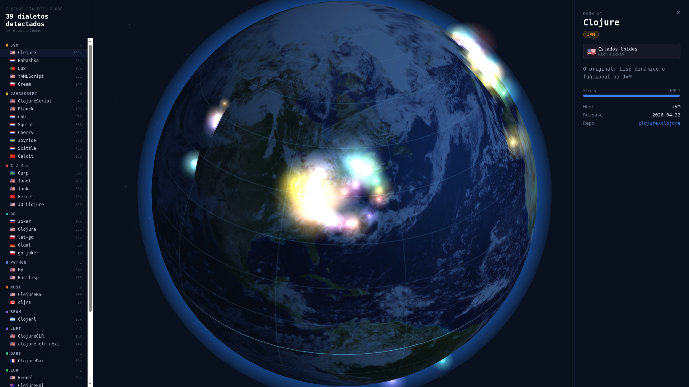

# Clojure Dialects Globe

An immersive, interactive 3D visualization of the vast Clojure dialect ecosystem.



## 🌐 Clojure Everywhere: One Language, Any Platform

This project is a living testament to the **Clojure Everywhere** philosophy. It is not just a visualization *of* Clojure dialects; it is a complex application built *entirely* in Clojure, demonstrating that a single, unified mental model can dominate any host platform.

### The Power of Portability
While the 3D globe illustrates the breadth of the ecosystem, the code itself proves its depth. By leveraging the same syntax and functional paradigms, we have built a seamless multi-platform experience:

- **Browser (ClojureScript):** High-performance 3D rendering with Three.js.
- **Mobile (ClojureDart):** Native-speed UI for Android and iOS using Flutter.
- **Server (Clojure JVM):** Robust data processing and API services.
- **CLI (Babashka):** Fast, native-feel scripts for automation and data enrichment.

Inspired by [clojure.cc/dialects](https://clojure.cc/dialects/), we transform a static table into a vibrant landscape that shows the language's colonization of the digital world.

## 🚀 Technical Architecture

We use Clojure to target the best host for every task:

- **Web Frontend:** [ClojureScript](https://clojurescript.org/) targets the JS engine, bringing immutable data structures to the 3D Web.
- **Mobile Application:** [ClojureDart](https://github.com/tenpureto/clojure-dart) targets the Dart VM, providing a functional bridge to [Flutter's](https://flutter.dev/) UI richness.
- **Automation & Data:** [Babashka](https://babashka.org/) leverages GraalVM to provide instant-startup scripts that orchestrate our data pipelines.
- **Backend Service:** [Clojure](https://clojure.org/) on the JVM provides the stability and performance needed for real-time dataset management.

## 🛠️ How it Works

The globe maps dialects to geographical "hubs" based on their host ecosystem or their creator's origin:
- **JVM Hub:** Centered in Chicago (US).
- **JavaScript Hub:** Centered in Amsterdam (NL).
- **Lua Hub:** Centered in Rio de Janeiro (BR) — where Lua was born.
- **Native/Rust/Go:** Distributed globally to represent the "native" expansion of the language.

Markers are grouped in rings to prevent overlap, ensuring every dialect remains selectable and visible.

## 📦 Getting Started

### Prerequisites
- [Babashka](https://babashka.org/) (for scripts)
- [Node.js](https://nodejs.org/) (for web development)
- [Java 17+](https://adoptium.net/) (for the API)

### Local Development (Web)
1. Clone the repository.
2. Navigate to the `web/` directory.
3. Install dependencies: `npm install`.
4. Start the development server: `npx shadow-cljs watch globe`.
5. Open `http://localhost:8080`.

### Building for Production (GitHub Pages)
The project is configured for static hosting:
```bash
# Update stars and generate data/dialects.edn
bb scripts/fetch_stars.bb

# Build optimized ClojureScript bundle
cd web
npm install
npx shadow-cljs release globe

# Prepare static data
mkdir -p public/data
cp ../data/dialects.edn public/data/
```

## 📈 Data Source
Data is sourced and enriched from project repositories across GitHub. To suggest a new dialect or update information, please open a Pull Request modifying `data/base.edn`.

---
*Built with ❤️ by the Clojure Community.*
